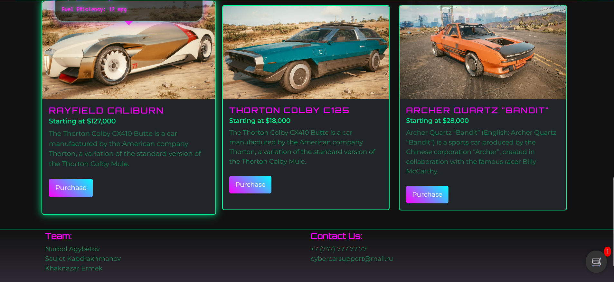

# CyberCar Frontend Pages - Saulet's Contribution

This repository contains the frontend pages I developed as part of our group's work on the "CYBERCAR" project. The pages are built using HTML, CSS, and JavaScript.

**Developed Pages:**

* **About Us:** This page provides information about the CyberCar project.

* **Models:** This page showcases the different CyberCar models.

Screenshots of these pages are included to demonstrate the visual design and layout.

**ABOUT US PAGE**

**CHECKOUT**

**MODELS**

